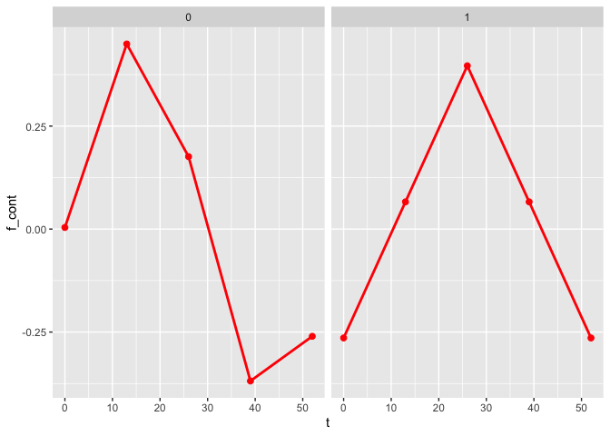
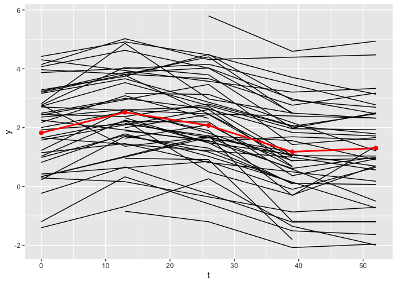

<!-- README.md is generated from README.Rmd. Please edit that file -->

# plsmmLasso

<!-- badges: start -->

[](https://github.com/Sami-Leon/plsmmLasso/actions/workflows/R-CMD-check.yaml)

<!-- badges: end -->

The objective of plsmmLasso is to facilitate the estimation of a
Regularized Partial Linear Semiparametric Mixed-Effects Model (PLSMM)
through a dictionary approach for modeling the nonparametric component.
The model employs a set of bases functions and automatically selects
them using a lasso penalty. Additionally, it conducts variable selection
on the fixed-effects using another lasso penalty. The implementation
also supports the inclusion of a random intercept.

## Installation

You can install the development version of plsmmLasso from
[GitHub](https://github.com/) with:

``` r
# install.packages("devtools")
devtools::install_github("Sami-Leon/plsmmLasso")
```

## Example I: A Guide to Fitting, Visualization, and Inference

### Fitting the model

Here’s a basic example using a simulated dataset to demonstrate how to
utilize the main functions of the plsmmLasso package. This example
assumes an effect of a grouping variable and different nonlinear
functions for each group.

``` r
library(plsmmLasso)

# Simulate a dataset
set.seed(123)
data_sim <- simulate_group_inter(
  N = 50, n_mvnorm = 3, grouped = TRUE,
  timepoints = 3:5, nonpara_inter = TRUE,
  sample_from = seq(0, 52, 13), 
  cos = FALSE, A_vec = c(1, 1.5)
)
sim <- data_sim$sim

# Fit the data
x <- as.matrix(sim[, -1:-3])
y <- sim$y
series <- sim$series
t <- sim$t
bases <- create_bases(t)
lambda <- 0.0046
gamma <- 0.00001
plsmm_output <- plsmm_lasso(x, y, series, t,
  name_group_var = "group", bases$bases,
  gamma = gamma, lambda = lambda, timexgroup = TRUE,
  criterion = "BIC"
)
```

One of the most important output of the `plsmm_lasso()` function is the
estimates of the fixed-effects.

``` r
plsmm_output$lasso_output$theta
#>  Intercept      group         x1         x2         x3         x4         x5 
#> 0.19729689 3.15155151 1.91905369 0.74891414 0.02274130 0.01291499 0.01049015
```

Here, we observe that some covariates have small values, but most are
non-zero. If we desire more regularization for the fixed-effects, we can
use a larger value for lambda.

### Hyperparameter tuning

``` r
lambda <- 0.1
plsmm_output <- plsmm_lasso(x, y, series, t,
  name_group_var = "group", bases$bases,
  gamma = gamma, lambda = lambda, timexgroup = TRUE,
  criterion = "BIC"
)
plsmm_output$lasso_output$theta
#> Intercept     group        x1        x2        x3        x4        x5 
#> 3.5544003 0.4262652 0.0000000 0.0000000 0.0000000 0.0000000 0.0000000
```

With a larger lasso penalty, more coefficients are set to zero.

The coefficients associated with the nonlinear functions are denoted by
alpha.

``` r
head(plsmm_output$lasso_output$alpha)
#> [1] -5.576108e-02 -4.720350e-01 -8.130512e-03  2.368476e-10 -7.129181e-06
#> [6]  0.000000e+00
```

Similar behavior would be observed for the alpha values if we were to
increase the value of gamma.

To find optimal values for gamma and lambda, we tune these
hyperparameters using BIC-type criteria with the `tune_plsmm()` function
and a grid search.

``` r
lambdas <- gammas <- round(exp(seq(log(1), log(1 * 0.00001),
              length.out = 5
)), digits = 5)

tuned_plsmm <- tune_plsmm(x, y, series, t,
                       name_group_var = "group", bases$bases,
                       gamma_vec = gammas, lambda_vec = lambdas, timexgroup = TRUE,
                       criterion = "BIC"
)
```

The `tune_plsmm()` function tries every possible combination of the
values from lambdas and gammas and returns the model with the best BIC
(other options are BICC and EBIC). This example is for illustration
purposes only; in practice, a more exhaustive grid should be used.

### Plotting the results

The `plot_fit()` function allows for the visualization of the estimated
mean trajectories as well as the estimate of the nonlinear functions. By
default, only the observed time points are being used. To use continuous
time points, the argument `predicted` can be set to `TRUE`.

``` r
plot_fit(x, y, series, t, name_group_var = "group", tuned_plsmm)
```



``` r

plot_fit(x, y, series, t, name_group_var = "group", tuned_plsmm, predicted = TRUE)
```


### Post-selection inference

To compute p-values on the fixed-effects, the `debias_plsmm()` function
can be used.

``` r
debias_plsmm(x, y, series, tuned_plsmm)
#>         Estimate   Debiased Std. Error   Lower 95% Upper 95%      p-value
#> group 3.20441442 3.31447827 0.33608394  2.65575376 3.9732028 6.079223e-23
#> x1    1.95569696 2.03694234 0.21339004  1.61869786 2.4551868 1.352832e-21
#> x2    0.72925412 0.68895582 0.26577859  0.16802979 1.2098818 9.535955e-03
#> x3    0.02755599 0.03780433 0.04645279 -0.05324313 0.1288518 4.157466e-01
#> x4    0.01691564 0.02535323 0.04110770 -0.05521786 0.1059243 5.373988e-01
#> x5    0.01569818 0.02732562 0.04056090 -0.05217374 0.1068250 5.005061e-01
```

The function reports the original coefficients, debiased coefficients,
standard errors, confidence intervals and p-values. These p-values are
already adjusted for the selection process of the lasso, and provide
valid inference.

### Test on the nonlinear functions

Finally, we can perform tests on the nonlinear functions. The first
element of the list is an overall test of equality. If the p-value is
$< 0.05$, we reject the null hypothesis of equality and conclude that
overall the two nonlinear functions are different. To obtain a
comparison at each time point, confidence bands are computed, and a
figure displaying these confidence bands is generated. For the time
points associated with confidence bands that include $0$, we cannot
reject the null hypothesis that the nonlinear functions are the same for
this time point. The data frame that is used to generate this figure can
be found in the second element of the output list.

``` r
test_f_results <- test_f(x, y, series, t,
 name_group_var = "group", tuned_plsmm,
 n_boot = 10, verbose = TRUE
)
#>   |                                                                              |                                                                      |   0%  |                                                                              |=======                                                               |  10%  |                                                                              |==============                                                        |  20%  |                                                                              |=====================                                                 |  30%  |                                                                              |============================                                          |  40%  |                                                                              |===================================                                   |  50%  |                                                                              |==========================================                            |  60%  |                                                                              |=================================================                     |  70%  |                                                                              |========================================================              |  80%  |                                                                              |===============================================================       |  90%  |                                                                              |======================================================================| 100%
#> 
#> Completed fitting Bootstrap samples. Now formatting results, and generating figure.
```


``` r
test_f_results[[1]]
#>           T p-value
#> 1 0.4785269       0
head(test_f_results[[2]])
#>     t   f diff.  Lower 95% Upper 95%
#> 1 0.0 0.2365327 0.00586791 0.4414301
#> 2 0.1 0.2400843 0.01051297 0.4443028
#> 3 0.2 0.2436013 0.01512247 0.4471456
#> 4 0.3 0.2470832 0.01969562 0.4499582
#> 5 0.4 0.2505294 0.02423163 0.4527404
#> 6 0.5 0.2539394 0.02872971 0.4554919
```

Similarly to the `plot_fit()` function, the argument `predicted` can be
changed to `TRUE` to display the joint confidence bands as a continuous
function of time rather than at the observed time points only.

``` r
test_f_results <- test_f(x, y, series, t,
 name_group_var = "group", tuned_plsmm,
 n_boot = 10, predicted = TRUE
)
#>   |                                                                              |                                                                      |   0%  |                                                                              |=======                                                               |  10%  |                                                                              |==============                                                        |  20%  |                                                                              |=====================                                                 |  30%  |                                                                              |============================                                          |  40%  |                                                                              |===================================                                   |  50%  |                                                                              |==========================================                            |  60%  |                                                                              |=================================================                     |  70%  |                                                                              |========================================================              |  80%  |                                                                              |===============================================================       |  90%  |                                                                              |======================================================================| 100%
#> 
#> Completed fitting Bootstrap samples. Now formatting results, and generating figure.
```


## Example II: Flexibility of the Model

### Model fitting without group-specific nonlinear functions

The plsmmLasso package offers flexibility; if the nonlinear functions do
not differ between groups, the `timexgroup` argument can be set to
`FALSE`. Below, we simulate a dataset where the nonlinear functions are
the same and fit the data accordingly.

``` r
# Simulate a dataset with equal nonlinear functions per group
set.seed(123)
data_sim <- simulate_group_inter(
  N = 50, n_mvnorm = 3, grouped = TRUE,
  timepoints = 3:5, nonpara_inter = FALSE,
  sample_from = seq(0, 52, 13), 
  cos = FALSE, A_vec = c(1, 1.5)
)
sim <- data_sim$sim

# Fit the data
x <- as.matrix(sim[, -1:-3])
y <- sim$y
series <- sim$series
t <- sim$t
bases <- create_bases(t)
tuned_plsmm <- tune_plsmm(x, y, series, t,
                       name_group_var = "group", bases$bases,
                       gamma_vec = gammas, lambda_vec = lambdas, timexgroup = FALSE,
                       criterion = "BIC"
)

plot_fit(x, y, series, t, name_group_var = "group", tuned_plsmm)
```


As observed, the estimates of the nonlinear functions are identical.

### Model fitting without grouping variable

It is also possible not to use any grouping variable for the
`name_group_var` argument. Here, we simulate a dataset without the
effect of a grouping variable, resulting in no difference in the height
of the overall mean trajectories and using the same nonlinear functions.

``` r
# Simulate a dataset with no group effect
set.seed(123)
data_sim <- simulate_group_inter(
  N = 50, n_mvnorm = 3, grouped = FALSE,
  timepoints = 3:5, nonpara_inter = FALSE,
  sample_from = seq(0, 52, 13), 
  cos = FALSE, A_vec = c(1, 1.5)
)
sim <- data_sim$sim

# Fit the data
x <- as.matrix(sim[, -1:-3])
y <- sim$y
series <- sim$series
t <- sim$t
bases <- create_bases(t)
tuned_plsmm <- tune_plsmm(x, y, series, t,
                       name_group_var = NULL, bases$bases,
                       gamma_vec = gammas, lambda_vec = lambdas, timexgroup = FALSE,
                       criterion = "BIC"
)

plot_fit(x, y, series, t, name_group_var = NULL, tuned_plsmm)
```



Only one figure is displayed now since there is no grouping variable.
